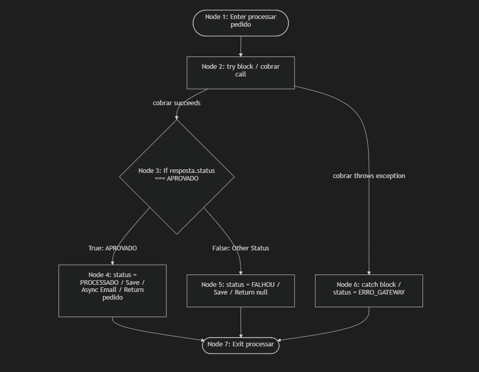
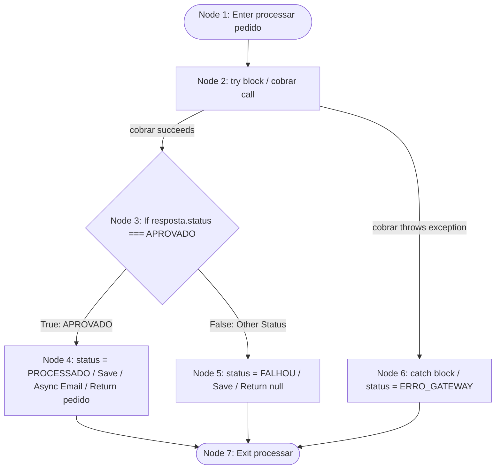
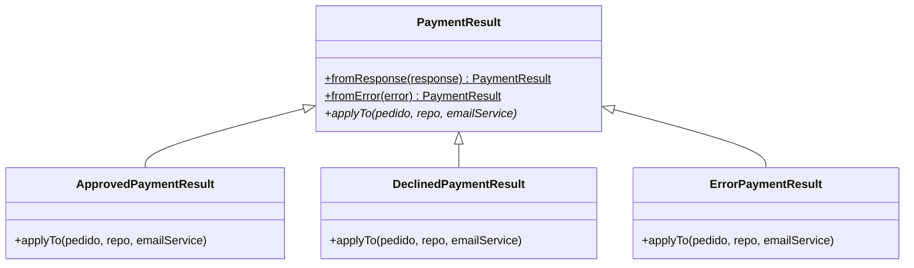

# Relatório Técnico de Engenharia de Software: Fases 1 & 2

Este documento descreve detalhadamente a análise de código legado, as estimativas de esforço e a refatoração arquitetural aplicada no microsserviço de **Processamento de Pedidos e Checkout** do projeto *O Apocalipse do Delivery*.

---

## 📈 FASE 1: Análise Estrutural e Métricas

### 1. Grafo de Fluxo de Controle (CFG) do Método Legado
O método principal analisado foi o `processar(pedido)` da classe `CheckoutService` legada.

#### Representação Visual
O diagrama abaixo representa as transições lógicas e caminhos independentes do método processar:



#### Representação Lógica (Mermaid Diagram)


---

### 2. Cálculo Matemático da Complexidade Ciclomática
Para determinar o número mínimo de caminhos independentes que precisam ser testados para garantir 100% de cobertura de código, aplicamos a fórmula clássica de Thomas McCabe:

$$V(G) = E - N + 2P$$

Onde:
* **$E$ (Arestas/Edges):** Caminhos de transição de controle = **8** (1->2, 2->3, 2->6, 3->4, 3->5, 4->7, 5->7, 6->7)
* **$N$ (Nós/Nodes):** Instruções ou blocos lógicos = **7**
  1. `Node 1`: Ponto de entrada do método.
  2. `Node 2`: Início do bloco `try` e chamada ao gateway `cobrar`.
  3. `Node 3`: Ponto de decisão `if (resposta.status === 'APROVADO')`.
  4. `Node 4`: Bloco interno do status aprovado (salvar pedido + disparar e-mail).
  5. `Node 5`: Bloco interno do status reprovado/recusado (salvar falha).
  6. `Node 6`: Bloco de captura de exceção `catch (error)` (salvar erro).
  7. `Node 7`: Ponto de saída comum do método.
* **$P$ (Componentes Conexos):** Como estamos avaliando um único método isolado, **P = 1**.

#### Cálculo:
$$V(G) = 8 - 7 + 2(1) = 3$$

#### Validação via Nós de Decisão:
$$V(G) = D + 1$$
Onde **$D$ (Nós de Decisão)** = **2** (o comando `if` de validação de status e o bloco de desvio implícito `try-catch`).
$$V(G) = 2 + 1 = 3$$

#### Caminhos Independentes Identificados:
1. **Caminho 1 (Sucesso):** Entrada $\rightarrow$ `try` $\rightarrow$ Cobrança aprovada $\rightarrow$ Salvar pedido `PROCESSADO` $\rightarrow$ Disparo de e-mail $\rightarrow$ Saída.
2. **Caminho 2 (Recusa de Negócio):** Entrada $\rightarrow$ `try` $\rightarrow$ Cobrança recusada $\rightarrow$ Salvar pedido `FALHOU` $\rightarrow$ Retorno null $\rightarrow$ Saída.
3. **Caminho 3 (Falha de Infraestrutura):** Entrada $\rightarrow$ `try` $\rightarrow$ Erro de rede/Timeout $\rightarrow$ `catch` $\rightarrow$ Salvar pedido `ERRO_GATEWAY` $\rightarrow$ Retorno null $\rightarrow$ Saída.

---

### 3. Estimativa Formal de Esforço de Testes
Utilizamos a técnica de **Pontos de Caso de Teste (TCP - Test Case Points)** adaptada para testes unitários, de integração e resiliência.

#### Classificação de Complexidade dos Casos de Teste (TC)
* **Simples (Peso 5):** Sem integrações complexas ou dependências externas (ex: validação de parâmetros).
* **Médio (Peso 10):** Envolve simulação simples de estado e chamadas de persistência local.
* **Complexo (Peso 15):** Envolve injeção de falhas temporárias, retentativas com backoff dinâmico, concorrência e circuit breakers.

#### Matriz de Casos de Teste e Pontos (TCP)

| ID | Cenário de Teste | Complexidade | Peso (TCP) | Justificativa |
| :--- | :--- | :--- | :--- | :--- |
| **TC01** | Processamento de Pagamento Autorizado (Sucesso) | Média | 10 | Requer mock de repositório e disparo assíncrono. |
| **TC02** | Tratamento de Pagamento Recusado (Negócio) | Média | 10 | Requer validação de exclusão de e-mail e persistência. |
| **TC03** | Resiliência com Retentativa Bem-sucedida | Complexa | 15 | Requer simulação de erro transitório e asserção de chamadas. |
| **TC04** | Falha de Infraestrutura com Retentativas Esgotadas | Complexa | 15 | Requer monitoramento de retentativas múltiplas e fallback. |
| **TC05** | Validação de Entrada de Dados (Payload Incompleto) | Simples | 5 | Apenas validação de regras de sanitização básicas. |
| **TC06** | Circuit Breaker Aberto (Fast Fail) | Complexa | 15 | Avalia transições de estados (CLOSED, OPEN) e rejeições rápidas. |
| **TC07** | Concorrência e SLO de Latência (Carga k6/Toxiproxy) | Complexa | 15 | Estresse concorrente massivo com injeção de latência. |
| **Total**| | | **85 TCP** | |

#### Cálculo de Horas/Homem (h/h)
Considerando um Fator de Produtividade (**FP**) médio de **2 h/h por TCP** (cobrindo a escrita dos cenários BDD, modelagem de builders, código TDD, execução das asserções e simulações de caos):

$$\text{Esforço Total} = 85 \text{ TCP} \times 2 \text{ h/h} = 170 \text{ horas/homem}$$

#### Divisão de Alocação de Recursos (Sprint de 2 semanas)
* **Desenvolvimento da Infraestrutura de Testes:** 24 h/h (Configuração do framework Jest, integração Toxiproxy e k6).
* **Escrita de Cenários e Especificações BDD:** 16 h/h (Levantamento do arquivo de features).
* **Implementação de Código via TDD (Red-Green-Refactor):** 80 h/h (Desenvolvimento guiado pelos testes).
* **Simulação de Engenharia do Caos e Ajuste de Thresholds:** 30 h/h (Ajustes de timeouts, retries e limites de latência p95).
* **Code Review, Homologação e CI:** 20 h/h (Garantia de integração contínua livre de bugs).
* **Recursos:** 1 Engenheiro de Software Sênior (focado em TDD e refatoração arquitetural) e 1 Engenheiro de QA/SRE (focado nos cenários de caos, k6 e resiliência de rede).

---

## 🛠️ FASE 2: Redesenho com BDD, TDD e Padrões de Projeto

Abaixo estão detalhados os padrões de projeto e refatorações aplicadas para mitigar o acoplamento rígido do código legado:

### 1. BDD (Especificação Viva)
Escrita em português estruturado (Dado-Quando-Então) no arquivo [checkout.feature](file:///c:/Git/%20Puc/o-apocalipse-do-delivery/tests/features/checkout.feature) mapeando com clareza o comportamento esperado sob cenários de sucesso, recusa, timeout, retry e circuit breaker.

### 2. Evitando o "Obscure Setup" via Data Builder
Substituímos declarações complexas de payloads nos testes pela classe de fabricação modular [PedidoBuilder.js](file:///c:/Git/%20Puc/o-apocalipse-do-delivery/tests/builders/PedidoBuilder.js) (Object Mother):
```javascript
// Exemplo de uso limpo e não-obscuro:
const pedido = PedidoBuilder.umPedido().comValor(120.00).build();
```

### 3. Diferenciação Estrita de Mocks e Stubs
* **Stubs (Simulação de Estado):** Implementado o `PaymentGatewayStub` para injetar respostas malformadas, sucessos controlados, rejeições e latências simuladas sob demanda nos testes.
* **Mocks (Asserção de Comportamento):** Implementado o `EmailServiceMock` para verificar exclusivamente o comportamento do sistema, garantindo através de asserções se o método `enviarConfirmacao` foi chamado ou não nos cenários correspondentes.

### 4. Refatorações Clássicas Aplicadas
* **Extract Method:** O algoritmo de validação de dados de entrada foi extraído do fluxo principal do serviço e encapsulado em [CheckoutValidator.js](file:///c:/Git/%20Puc/o-apocalipse-do-delivery/src/services/validation/CheckoutValidator.js).
* **Introduce Parameter Object:** Agrupamento dos dados do pedido em um modelo uniforme estruturado, sanitizado e validado pelo validator.
* **Replace Conditional with Polymorphism (Refatoração Principal):**
  Eliminação total de blocos aninhados de `if/else` que tratavam o retorno do gateway no fluxo do checkout. A lógica de transição de estado e pós-cobrança foi delegada para classes derivadas de `PaymentResult` (definidas em [PaymentResult.js](file:///c:/Git/%20Puc/o-apocalipse-do-delivery/src/services/payment/PaymentResult.js)):
  


Com esta abordagem, a execução no arquivo principal [CheckoutService.js](file:///c:/Git/%20Puc/o-apocalipse-do-delivery/src/services/CheckoutService.js) ficou enxuta e focada:
```javascript
const resposta = await this.circuitBreaker.execute(async () => {
  return await this.retryPolicy.execute(async () => {
    return await this.gatewayPagamento.cobrar(pedido.valor, pedido.cartao);
  });
});
paymentResult = PaymentResult.fromResponse(resposta);
...
return await paymentResult.applyTo(pedido, this.pedidoRepository, this.emailService);
```

### 5. Resiliência de Rede Implementada
* [CircuitBreaker.js](file:///c:/Git/%20Puc/o-apocalipse-do-delivery/src/services/resilience/CircuitBreaker.js): Customizado nativamente para controle de falhas em janelas deslizantes (threshold de 50%).
* [RetryPolicy.js](file:///c:/Git/%20Puc/o-apocalipse-do-delivery/src/services/resilience/RetryPolicy.js): Executa retentativas com recuo (backoff) e limitação de timeout integrada por `Promise.race`.
